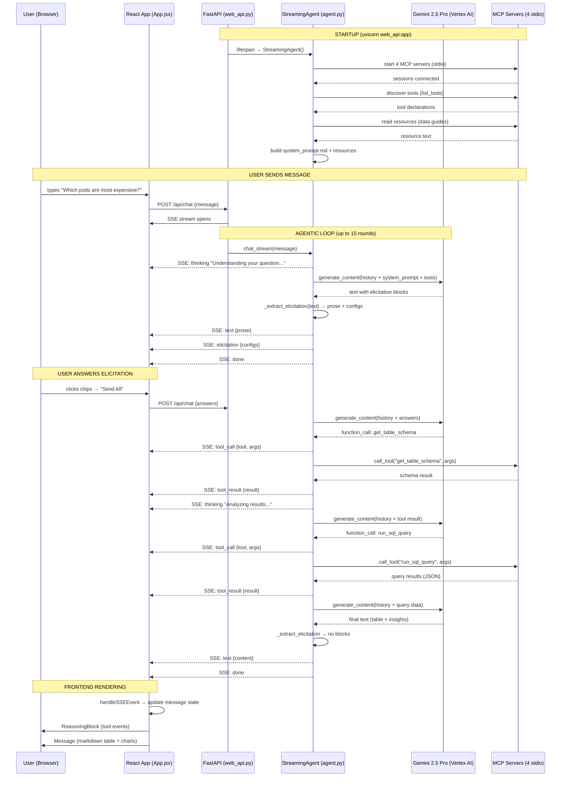

# FinOps Agent — Architecture & Request Lifecycle

## System Overview

```
User (Browser) → React App → FastAPI (SSE) → StreamingAgent → Gemini 2.5 Pro
                                                    ↕ tool calls
                                            4 MCP Servers (stdio)
                                            ├── BQ Server      (BigQuery cost data)
                                            ├── SQL Server     (recommendations, K8s)
                                            ├── Analytics      (anomaly detection, forecasting)
                                            └── File Server    (report generation)
```

## Sequence Diagram



## File Map

### Backend

| File | Role |
|------|------|
| `agent.py` | Core agent: starts MCP servers, discovers tools, loads system prompt, runs agentic loop |
| `web_api.py` | FastAPI wrapper: SSE streaming, elicitation extraction, file download endpoint |
| `prompts/system_prompt.md` | System prompt: tool routing, elicitation rules, label guidelines, response format |

### MCP Servers

| File | Role |
|------|------|
| `mcp_servers/finops_bq_server.py` | BigQuery: `run_bq_query`, `bq_list_dimension_values` |
| `mcp_servers/finops_sql_server.py` | SQL Server: `run_sql_query`, `get_table_schema`, `lookup_identity` |
| `mcp_servers/finops_analytics_server.py` | Analytics: `detect_anomalies`, `forecast`, `calculate_growth` |
| `mcp_servers/finops_file_server.py` | File I/O: `write_file`, `export_csv` (sandboxed to `reports/`) |

### Frontend

| File | Role |
|------|------|
| `frontend/src/App.jsx` | Session management, scope context, SSE stream reader |
| `frontend/src/components/Message.jsx` | Markdown rendering, typing effect, tables, elicitation routing |
| `frontend/src/components/ElicitationInput.jsx` | 10 dynamic input types + ElicitationGroup |
| `frontend/src/components/ReasoningBlock.jsx` | Transparency panel for tool calls |
| `frontend/src/components/ChartView.jsx` | Recharts visualization |

## SSE Event Types

| Event | Payload | When |
|-------|---------|------|
| `thinking` | `{message}` | Agent processing |
| `tool_call` | `{tool, server, args}` | Tool invocation |
| `tool_result` | `{tool, result, chars}` | Tool response |
| `text` | `{content}` | Final prose (elicitation stripped) |
| `elicitation` | `{type, label, options, ...}` | Dynamic input needed |
| `error` | `{message}` | Error occurred |
| `done` | `{rounds}` | Stream complete |

## Elicitation Input Types

| Type | Use Case |
|------|----------|
| `chips` | 2-7 options, single select |
| `multi-chips` | 2-7 options, multi select |
| `dropdown` | 8-30 options, single select |
| `multi-dropdown` | 8-30 options, multi select |
| `searchable` | 30+ options, type-ahead |
| `date-range` | From/to date pickers |
| `slider` | Numeric threshold |
| `toggle` | Binary yes/no |
| `text-input` | Free-form text |
| `checkbox-list` | 4-15 visible checkboxes |
